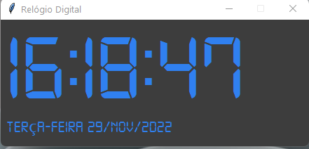
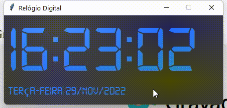

# RELOGIO DIGITAL COM DTM

## Função : 

* Programa desenvolvido em Python com uso de uma fonte personalizada (TTF),
A fim de realizar um teste de um CRUD, ou seja, operações básicas do sistema.

## Ferramentas e tecnologias usadas:
1.Python 
2.Visual Studio Code

 
 

 
 

